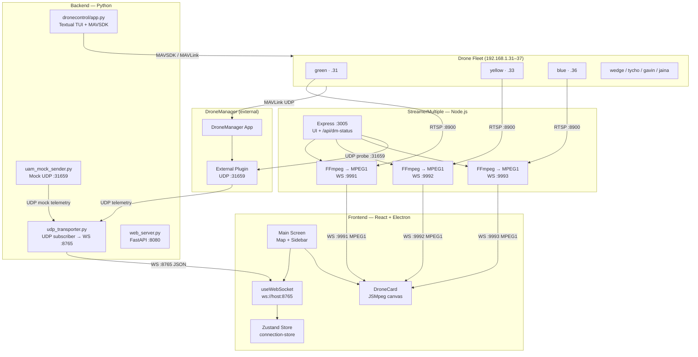
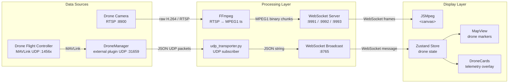
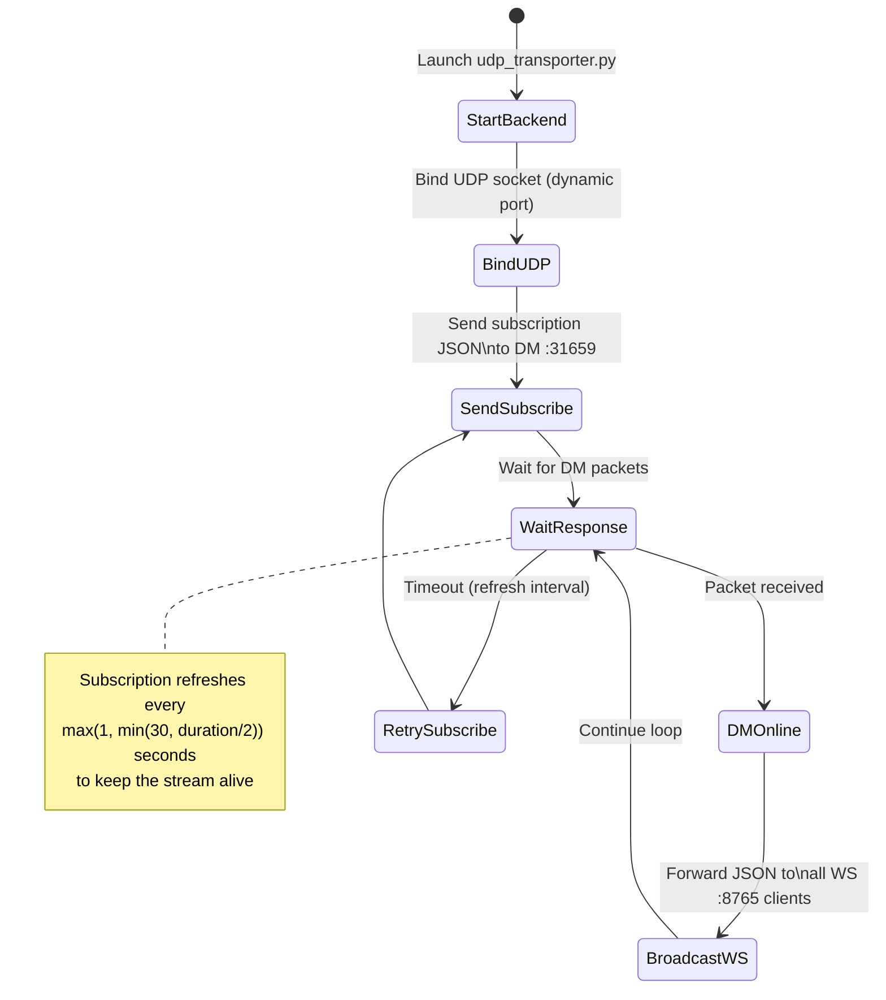
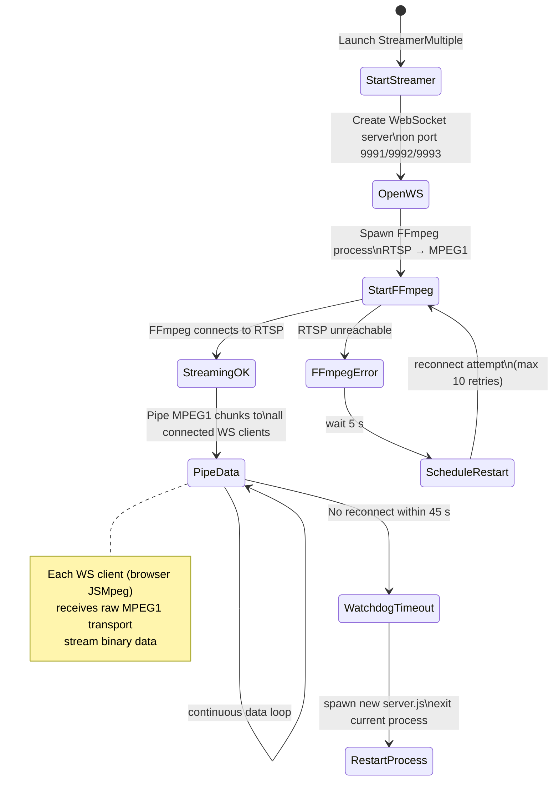
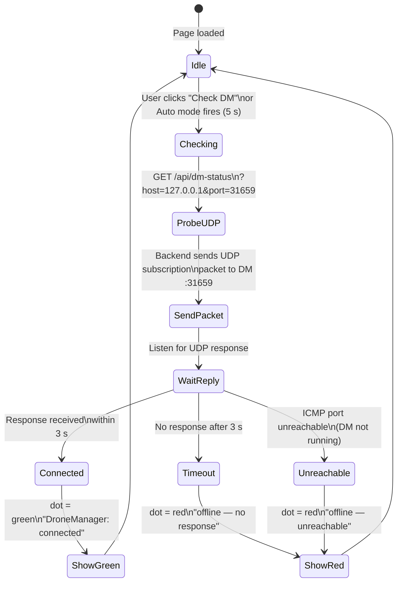
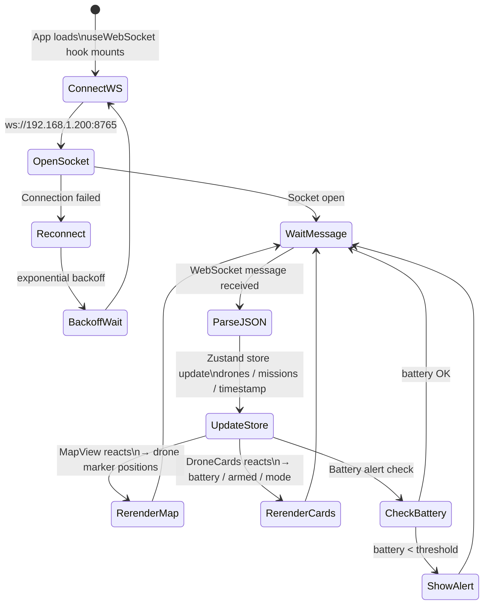
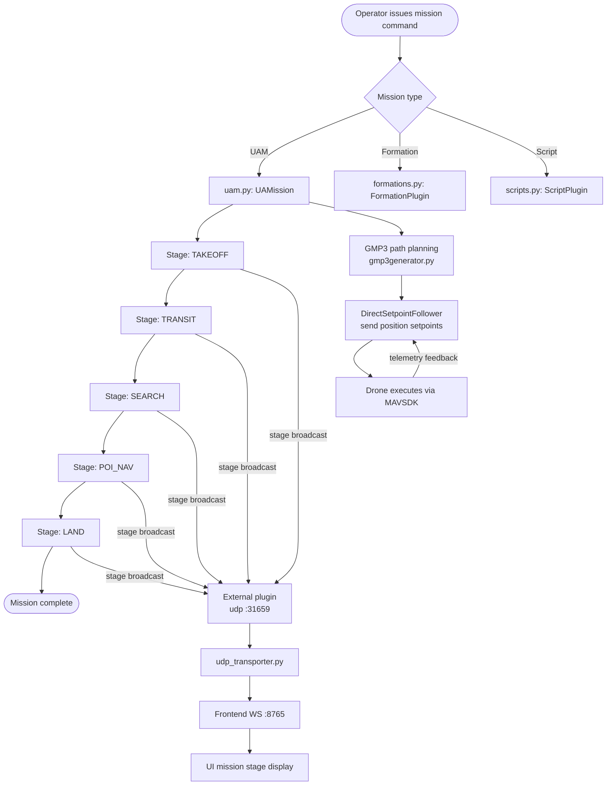
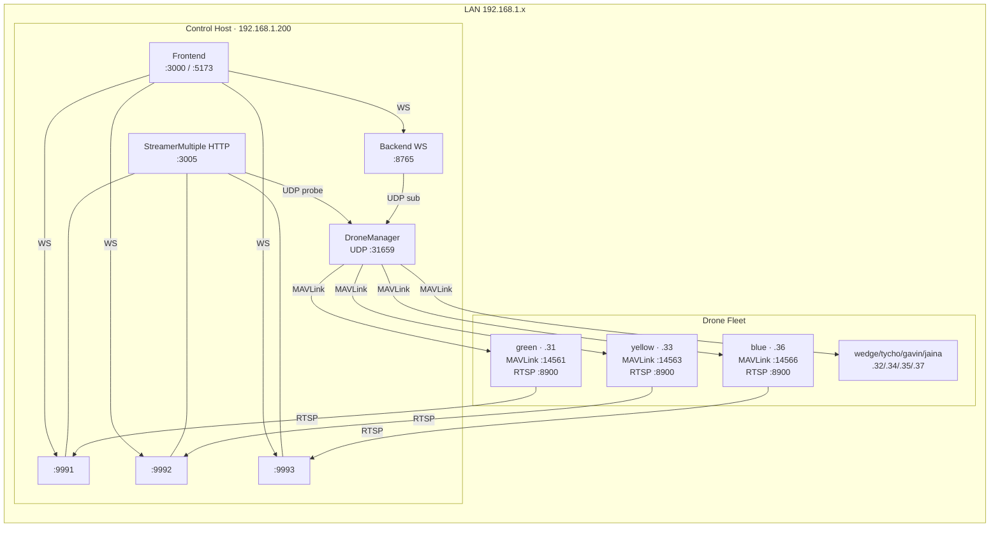

# UAM25 Control Hub — System Documentation

> **Project:** Urban Air Mobility (UAM) multi-drone control and streaming platform
> **Stack:** React + Electron (frontend) · Python FastAPI / MAVSDK (backend) · Node.js + FFmpeg (streamer)
> **Network:** LAN — control host at `192.168.1.200`, drones at `192.168.1.31–37`

---

## Table of Contents

1. [System Overview](#1-system-overview)
2. [Component Descriptions](#2-component-descriptions)
3. [Architecture Graph (graph TD)](#3-architecture-graph)
4. [Data Flow Diagram](#4-data-flow-diagram)
5. [Activity Diagrams](#5-activity-diagrams)
6. [Network & Port Reference](#6-network--port-reference)
7. [Environment Configuration](#7-environment-configuration)
8. [Directory Structure](#8-directory-structure)

---

## 1. System Overview

UAM25 is a ground-control system for coordinating and monitoring a fleet of up to 8 autonomous drones. It provides:

- **Real-time telemetry** — position, velocity, attitude, battery, armed state, flight mode
- **Live video streaming** — RTSP feeds from drone cameras converted to WebSocket-delivered MPEG1
- **Mission management** — UAM-specific flight missions, geofencing, formation control
- **DroneManager (DM) integration** — connects to the DroneManager service via UDP external plugin for state updates

The system is composed of three independently deployable services:

| Service | Technology | Purpose |
|---|---|---|
| **Frontend** | React 18 + Electron 41 + Vite | UI — map, drone cards, video feeds |
| **Backend (fromDM)** | Python, FastAPI, MAVSDK, Textual | Drone control, telemetry bridge, mission logic |
| **StreamerMultiple** | Node.js, Express, FFmpeg, WS | RTSP → MPEG1 → WebSocket video pipeline |

---

## 2. Component Descriptions

### 2.1 Frontend (`FRONTEND_UAM/`)

Built with **React 18**, **TypeScript**, **TailwindCSS**, and **Electron 41**. Can run as a desktop app or plain web app.

| Module | Path | Role |
|---|---|---|
| Main Screen | `src/screens/Element/Element.tsx` | Root layout — map + sidebar + panels |
| Map View | `src/components/map/MapView.tsx` | Renders drone positions on map |
| Drone Sidebar | `src/components/drones/DroneCardsSidebar.tsx` | Live drone status cards |
| Drone Card | `src/components/drones/DroneCard.tsx` | Per-drone JSMPEG video + telemetry |
| WebSocket Hook | `src/hooks/useWebSocket.ts` | Connects to backend on `ws://<host>:8765` |
| Connection Store | `src/stores/connection-store.tsx` | Zustand state — drone data, DM status, swap state |
| API Client | `src/api/api.tsx` | Axios HTTP client for REST commands |

**Key env vars:**
```
VITE_WS_URL=ws://192.168.1.200:8765
VITE_LAN_HOST=192.168.1.200
```

---

### 2.2 Backend (`backend/backend/fromDM/`)

Python service with two layers:

**Layer 1 — DroneControl TUI app** (`src/dronecontrol/app.py`)
Textual-based CLI that directly manages drone connections via MAVSDK/MAVLink. Handles arm/disarm, takeoff/land, fly-to, geofence, missions, plugins.

**Layer 2 — UDP Transporter** (`udp_transporter.py`)
Lightweight bridge: subscribes to DroneManager's external plugin (UDP `31659`), receives JSON telemetry, and broadcasts it over WebSocket on port `8765` to the frontend.

**Mock / Test senders:**
- `SAR-UAM-log.py` — sends static mock telemetry on UDP `31659`
- `uam_mock_sender.py` — synchronized multi-drone mock (takeoff → search → POI → land)

---

### 2.3 StreamerMultiple (`STREAMERMULTIPLE_UAM/STREAMERMULTIPLE/`)

Node.js Express server that bridges drone RTSP camera streams to browser-playable WebSocket MPEG1 streams.

| Drone | RTSP Source | WebSocket Out |
|---|---|---|
| green | `rtsp://192.168.1.31:8900/live` | `ws://<host>:9991` |
| yellow | `rtsp://192.168.1.33:8900/live` | `ws://<host>:9992` |
| blue | `rtsp://192.168.1.36:8900/live` | `ws://<host>:9993` |

FFmpeg transcodes each stream to MPEG1 at 1280×720, 30fps, zero-latency. The browser uses JSMpeg to decode and render on a `<canvas>`.

`/api/dm-status` — UDP probe endpoint: sends a subscription packet to DM's external plugin port and returns `{ connected: bool }` within 3 s.

**Build:** `npm run build` → `dist/StreamerMultiple.exe` (pkg-bundled, Windows x64)

---

### 2.4 DroneManager (`C:\Users\ttzhm\Documents\Workspace\DroneManager`)

External application. Exposes a **UDP external plugin server on port `31659`**. Clients subscribe by sending:
```json
{ "frequency": 5, "duration": 60 }
```
DM then pushes JSON telemetry updates back to the subscriber's UDP port for the specified duration.

---

## 3. Architecture Graph



---

## 4. Data Flow Diagram



---

## 5. Activity Diagrams

### 5.1 Drone Telemetry Startup



---

### 5.2 RTSP Stream Pipeline (per drone)



---

### 5.3 DM Connection Check (StreamerMultiple UI)



---

### 5.4 Frontend Drone Data Update Cycle



---

### 5.5 Mission Execution Flow (Backend)



---

## 6. Network & Port Reference



### Full Port Table

| Port | Protocol | Service | Direction | Purpose |
|------|----------|---------|-----------|---------|
| 3005 | HTTP | StreamerMultiple | inbound | Web UI, `/api/dm-status` |
| 8080 | HTTP + WS | web_server.py | inbound | FastAPI REST + WebSocket API |
| 8765 | WebSocket | udp_transporter.py | inbound | Telemetry broadcast to frontend |
| 8900 | RTSP | Drone cameras | outbound | Camera video source |
| 9991 | WebSocket | StreamerMultiple | inbound | green drone MPEG1 video |
| 9992 | WebSocket | StreamerMultiple | inbound | yellow drone MPEG1 video |
| 9993 | WebSocket | StreamerMultiple | inbound | blue drone MPEG1 video |
| 14561–14567 | UDP | MAVLink / MAVSDK | outbound | Drone flight control |
| 31659 | UDP | DroneManager external plugin | bidirectional | Telemetry subscription |
| 31660 | UDP | web_server.py | inbound | Drone data ingress |
| 50051 | gRPC | MAVSDK server | outbound | Drone SDK interface |

---

## 7. Environment Configuration

### Frontend (`.env` / `.env.production`)

```env
VITE_WS_URL=ws://192.168.1.200:8765
VITE_LAN_HOST=192.168.1.200
```

The frontend auto-detects the hostname from `window.location.hostname`. If it starts with `192.`, it uses that directly; otherwise it falls back to `VITE_LAN_HOST`.

### Backend (`udp_transporter.py`)

| Env Var | Default | Description |
|---|---|---|
| `DM_UDP_HOST` | `127.0.0.1` | DroneManager host |
| `DM_UDP_PORT` | `31659` | DroneManager UDP port |
| `DM_SUB_FREQUENCY` | `5` | Subscription frequency (Hz) |
| `DM_SUB_DURATION` | `60` | Subscription window (seconds) |
| `DM_SUBSCRIBE` | `1` | Enable subscription loop |
| `UDP_LISTEN_PORT` | `0` (dynamic) | Local UDP bind port |

### StreamerMultiple (`server.js`)

| Env Var | Default | Description |
|---|---|---|
| `AUTO_RESTART_ON_STREAM_FAILURE` | `1` | Enable watchdog restart |
| `STREAM_FAILURE_TIMEOUT_MS` | `45000` | Time before forced restart |

---

## 8. Directory Structure

```
UAM25/
├── FRONTEND_UAM/
│   ├── src/
│   │   ├── screens/Element/Element.tsx       ← main page
│   │   ├── components/
│   │   │   ├── map/                          ← MapView, markers, controls
│   │   │   ├── drones/                       ← DroneCard, sidebar
│   │   │   └── ui/                           ← Radix UI primitives
│   │   ├── hooks/useWebSocket.ts             ← WS :8765 connection
│   │   ├── stores/connection-store.tsx       ← Zustand global state
│   │   ├── api/                              ← Axios REST + hooks
│   │   └── data/                             ← droneData, mapData
│   ├── electron/main.js                      ← Electron entry
│   └── .env / .env.production
│
├── backend/backend/fromDM/
│   ├── udp_transporter.py                    ← DM → WS :8765 bridge  ★ main service
│   ├── uam_mock_sender.py                    ← mock multi-drone telemetry
│   ├── SAR-UAM-log.py                        ← static mock telemetry
│   ├── web_server.py                         ← FastAPI :8080 + WS
│   └── src/dronecontrol/
│       ├── app.py                            ← Textual TUI drone manager
│       ├── dronemanager.py
│       ├── drone.py
│       ├── navigation/                       ← GMP3, setpoint, geofence
│       ├── missions/uam.py                   ← UAM mission stages
│       └── plugins/                          ← external, mission, formation
│
├── STREAMERMULTIPLE_UAM/STREAMERMULTIPLE/
│   ├── server.js                             ← Express + RTSP bridge  ★ main service
│   ├── rtsp-stream.js                        ← RtspStream class (FFmpeg + WS)
│   ├── index.html                            ← Streamer UI (JSMpeg + DM panel)
│   ├── jsmpeg.min.js                         ← MPEG1 browser decoder
│   ├── ffmpeg/bin/ffmpeg.exe                 ← FFmpeg binary
│   └── dist/
│       ├── StreamerMultiple.exe              ← pkg-bundled exe
│       ├── index.html                        ← copied by build script
│       └── jsmpeg.min.js                     ← copied by build script
│
└── SYSTEM_DOCUMENTATION.md                  ← this file
```

---

## Quick-Start Reference

### Start telemetry bridge (no drones, mock data)
```bash
cd backend/backend/fromDM
python uam_mock_sender.py   # terminal 1 — sends mock UDP telemetry on :31659
python udp_transporter.py   # terminal 2 — bridges to WS :8765
```

### Start video streamer (development)
```bash
cd STREAMERMULTIPLE_UAM/STREAMERMULTIPLE
npm start
# → http://localhost:3005
```

### Build streamer exe
```bash
npm run build
# → dist/StreamerMultiple.exe + dist/index.html + dist/jsmpeg.min.js
```

### Start frontend (development)
```bash
cd FRONTEND_UAM
npm run dev         # web browser at http://localhost:5173
# or
npm run electron:dev  # Electron desktop window
```
